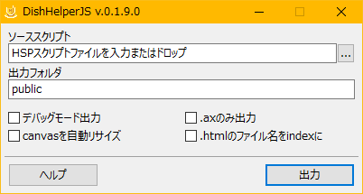

# DishHelperJS

HSP3Dish対応のHSPスクリプトをWEBブラウザ上(HTML5)で動作するように変換するためのツールです。
HSPパッケージに標準付属しているHSP3Dish helperのHTML5変換部分を切り出したものを機能拡張しています。
またHSP3Dish helperはデータファイルを一つのファイルにまとめて出力しますが、DishHelperJSではファルダ階層含めデータファイルをそのまま出力します。

## インストール方法

`hsp3dh_js.exe` と `hsp3js` フォルダ（中のファイルも）をHSPインストールフォルダにコピーします。
`copy.hsp` を実行することでもコピーできます。

## 使用方法

`hsp3dh_js.exe` を起動するとメインウィンドウが開きます。
[コマンドライン](#コマンドラインパラメータについて)からパラメータを指定して起動させることもできます。

出力ボタンを押すとソーススクリプトが変換され出力フォルダ内に出力されます。

- ソーススクリプト

	- 変換するスクリプトファイルを指定してください。
	- 直接入力するか右のボタンからダイアログで選択、またはエクスプローラからのファイルドロップも受け付けます。

- 出力フォルダ

	- 出力ファイルが格納されるフォルダ名です。
	- 出力時に該当フォルダがない場合は作成され、ある場合は上書きされます。
	- フォルダ名だけが指定されている場合はソーススクリプトがあるファルダ内に作成されます。
	- 相対パスや絶対パスを指定するとソースフォルダの外に出力することもできます。

- デバッグモード出力

	- 出力されたHTMLにデバッグ文字列を出力するテキストエリアを付加します。
	- canvasの自動リサイズは無効になります。

- .axのみ出力

	- ソーススクリプトをコンパイルしたAXファイルのみ出力します。
	- 出力フォルダが作成済みの場合はその中にもコピーされます。
	- 一度全体を出力した後にスクリプトの変更のみ反映させる場合にその他の出力処理が省けます。

- canvasを自動リサイズ

	- canvasを縦横比固定でビューポートにフィットするように拡縮します。

- .htmlのファイル名をindexに

	- 出力される `***.html` のファイル名を `index.html` にします。
	- オフの場合デフォルトではソーススクリプトと同名になります。

## 出力ファイルについて

出力が成功すると出力フォルダには、HTMLファイル、ソーススクリプトをコンパイルしたAXファイル、データファイル、ランタイムファイル(JS,CSS)が格納されます。
これらのファイルをフォルダごとそのままWEB上にアップロードしHTMLをブラウザで開くことでプログラムの動作を確認できます。
ローカルのPC上では通常は動作しないので注意してください。（ローカルでは動作可能なサーバーが必要）

## データファイルについて

スクリプトのcelloadやmmloadなどで外部から読み込む画像や音声などがデータファイルに該当します。
これらのファイルは出力時にソーススクリプトがあるフォルダ、またはその中にあるdataやresフォルダ（とそのサブフォルダ）の中から拡張子を基準に検索されデータファイルとして出力されます。
検索対象となるフォルダや拡張子、対象外となるファイルは `hsp3dish.ini` で指定することができます。

一度出力した後、ソース側のデータファイルを削除もしくは改名して再出力した場合、出力フォルダには以前のデータファイルが残っているため無駄なファイルができてしまいます。
そのためそのような場合は出力前に出力フォルダを削除するか出力フォルダ名を変更することを勧めます。

スクリプトにcelloadなどでデータファイル名を記述する際に階層の区切りがある場合は、円記号（バックスラッシュ）`\` ではなくスラッシュ `/` を用いてください。
円記号だとWindows上では読み込めてもWEBブラウザ上ではエラーになります。

## hsp3dish.ini について

ソーススクリプトと同じフォルダにある `hsp3dish.ini` は出力時に読み込まれ様々な設定ができます。

	wx=320
	wy=240
	Zoom=2
	UTF8=1

このように記述します。各設定は一行で記述する必要があります。
記述を省略した設定は ( ) 内のデフォルトの値が使われます。

- `wx`, `wy`(640, 480)

	- スクリプトの動作解像度。screen命令の画面サイズに該当します。

- `Zoom`(1)

	- 表示倍率、上記の `wx`, `wy`の値にこの倍率を乗じたものがブラウザで表示されるcanvasのサイズになります。
	- 1.5 のように少数点以下も指定可。

- `Step`(5000)

	- ブラウザに処理を返すまでの実行ステップ数。
	- 処理落ちや描画が点滅する場合この数値を増やせば改善されやすくなりますが、その分ブラウザ側の操作等が固まりやすくなります。

- `UTF8`(0)

	- スクリプトがUTF-8で書かれている場合は 1 を指定してください。

- `StartName`(ソーススクリプトのファイル名)

	- 出力されるHTMLとAXのファイル名。

- `DataFolder`(.\\|data|res)

	- データファイルの検索対象となるフォルダ名。
	- `|` 区切りで複数指定可。
	- ソースフォルダは `.\` を指定。
	- ソースフォルダ以外のフォルダはサブフォルダも検索対象になります。

- `DataExtensions`(bmp|png|jpg|jpeg|wav|mp3|ogg|gpb|material|frag|vert|ttf)

	- データファイルの検索対象となる拡張子。
	- `|` 区切りで複数指定可。
	- 拡張子なしは `_` を指定。

- `IgnoredFiles`(obj|hsptmp|packfile)

	- データファイルの対象外となるファイル名。
	- `|` 区切りで複数指定可。
	- 検索対象の拡張子をもつファイルであってもここで指定されたファイルは除外されます。

- `OutProjFolder`(ソーススクリプト名)

	- 出力されたフォルダ内にあるプロジェクトフォルダ名。
	- `OutDishFolder` の設定と同じ名前は使用できません。

- `OutDishFolder`(dish)

	- 出力されたフォルダ内にあるランタイムフォルダ名。
	- `OutProjFolder` の設定と同じ名前は使用できません。

- `Title`(ソーススクリプト名)

	- HTMLのタイトル。

- `HtmlHeader`( )

	- canvasの上部に配置するテキスト。
	- HTMLタグも使用可。
	- canvasの自動リサイズが有効な場合は無視されます。

- `HtmlFooter`( )

	- canvasの下部に配置するテキスト。
	- HTMLタグも使用可。
	- デバッグモードで出力した場合は直前にデバッグ用のテキストエリアが挿入されます。
	- canvasの自動リサイズが有効な場合は無視されます。

- `StyleTextColor`(#CCC)

	- HTMLの文字色。CSS形式で記述してください。

- `StyleBgColor`(#222)

	- HTMLの背景色。CSS形式で記述してください。

- `Style`( )

	- 追加するスタイルシート。

## コマンドラインパラメータについて

コマンドラインからパラメータを付けて起動することで、[使用方法](#使用方法)にあるオプションを指定したりメインウィンドウを介さず直接出力することができます。
それぞれのパラメータは半角空白区切りで指定します。

- `ソーススクリプト名`

	- 変換するスクリプトファイルをフルパスで指定します。
	- パスに半角空白が含まれるとそこで区切れてしまうため二重引用符 `"` で囲ってください。

- `/outdir=出力フォルダ名`

	- 出力フォルダを指定します。

- `/debug`

	- デバッグモードで出力します。

- `/axonly`

	- AXファイルのみ出力します。

- `/resize`

	- canvasの自動リサイズを有効にします。

- `/index`

	- 出力されるHTMLファイル名を `index.html` にします。

- `/nowin`

	- メインウィンドウを開かず直接出力します。

- `/lang=en`

	- アプリケーションで表示される言語を英語にします。

- `/ver`

	- アプリケーション情報を表示します。

## ライセンス

- [NYSL(Version 0.9982)](http://www.kmonos.net/nysl/)
